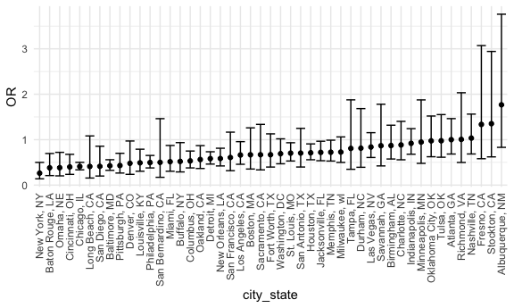
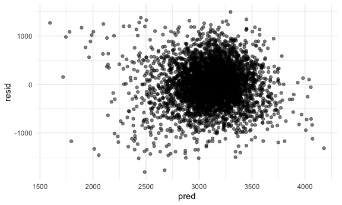
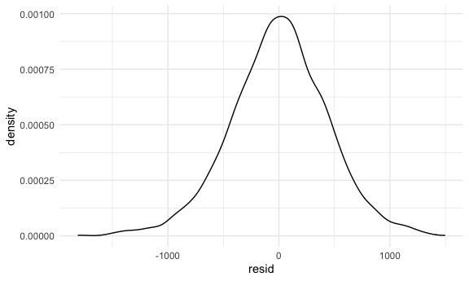

Homework 6
================
Jingyi Zhang

## Problem 1

``` r
homicide_df =
  read_csv("./homicide_data/homicide-data.csv", na = c("", "NA", "Unknown")) %>% 
  mutate(
    city_state = str_c(city, state, sep = ", "),
    victim_age = as.numeric(victim_age),
    resolution = case_when(
      disposition == "Closed without arrest" ~ 0,
      disposition == "Open/No arrest"        ~ 0,
      disposition == "Closed by arrest"      ~ 1)
  ) %>% 
  filter(
    victim_race %in% c("White", "Black"),
    city_state != "Tulsa, AL") %>% 
  select(city_state, resolution, victim_age, victim_race, victim_sex)
```

    ## Parsed with column specification:
    ## cols(
    ##   uid = col_character(),
    ##   reported_date = col_double(),
    ##   victim_last = col_character(),
    ##   victim_first = col_character(),
    ##   victim_race = col_character(),
    ##   victim_age = col_double(),
    ##   victim_sex = col_character(),
    ##   city = col_character(),
    ##   state = col_character(),
    ##   lat = col_double(),
    ##   lon = col_double(),
    ##   disposition = col_character()
    ## )

<br />

### Start with one city

``` r
baltimore_df =
  homicide_df %>% 
  filter(city_state == "Baltimore, MD")

# fit a generalized linear model
glm(resolution ~ victim_age + victim_race + victim_sex, 
    data = baltimore_df,
    family = binomial()) %>% 
  broom::tidy() %>% 
  mutate(
    OR = exp(estimate), # odds ratio
    CI_lower = exp(estimate - 1.96 * std.error),
    CI_upper = exp(estimate + 1.96 * std.error)
  ) %>% 
  select(term, OR, starts_with("CI")) %>% 
  knitr::kable(digits = 3)
```

| term              |    OR | CI\_lower | CI\_upper |
| :---------------- | ----: | --------: | --------: |
| (Intercept)       | 1.363 |     0.975 |     1.907 |
| victim\_age       | 0.993 |     0.987 |     1.000 |
| victim\_raceWhite | 2.320 |     1.648 |     3.268 |
| victim\_sexMale   | 0.426 |     0.325 |     0.558 |

<br />

### Try this across cities

``` r
models_results_df =
  homicide_df %>% 
  nest(data = -city_state) %>% 
  mutate(
    models = 
      map(.x = data, ~glm(resolution ~ victim_age + victim_race + victim_sex, data = .x, family = binomial())),
    results = map(models, broom::tidy)
    ) %>% 
  select(city_state, results) %>% 
  unnest(results) %>% 
  mutate(
    OR = exp(estimate), # odds ratio
    CI_lower = exp(estimate - 1.96 * std.error),
    CI_upper = exp(estimate + 1.96 * std.error)
  ) %>% 
  select(city_state, term, OR, starts_with("CI"))
```

``` r
models_results_df %>% 
  filter(term == "victim_sexMale") %>% 
  mutate(city_state = fct_reorder(city_state, OR)) %>% 
  ggplot(aes(x = city_state, y = OR)) +
  geom_point() +
  geom_errorbar(aes(ymin = CI_lower, ymax = CI_upper)) +
  theme(axis.text.x = element_text(angle = 90, vjust = 0.5, hjust = 1))
```



<br />

## Problem 2

``` r
birth_weight_df =
  read_csv("./birth_weight_data/birthweight.csv") %>% 
  janitor::clean_names() %>% 
  drop_na() %>% 
  filter(frace != 9) %>% 
  mutate(
    babysex = case_when(
      babysex == 1 ~ "male",
      babysex == 2 ~ "female"
    ),
    malform = case_when(
      malform == 0 ~ "absent",
      malform == 1 ~ "present"
    ),
    frace = case_when(
      frace == 1 ~ "White",
      frace == 2 ~ "Black",
      frace == 3 ~ "Asian",
      frace == 4 ~ "Puerto Rican",
      frace == 8 ~ "Other"
    ),
    mrace = case_when(
      mrace == 1 ~ "White",
      mrace == 2 ~ "Black",
      mrace == 3 ~ "Asian",
      mrace == 4 ~ "Puerto Rican",
      mrace == 8 ~ "Other"
    )
  ) %>% 
  mutate(
    across(where(is.character), as.factor)
  )
```

    ## Parsed with column specification:
    ## cols(
    ##   .default = col_double()
    ## )

    ## See spec(...) for full column specifications.

<br />

### Build models - Step-wise Backward Method

Model 1:

The assumption is that mother’s physical characteristics have effects on
baby birth weights.

First, fit the model for all predictors.

``` r
fit_df =
  birth_weight_df %>% 
  select(bwt, delwt, gaweeks, menarche, mheight, momage, ppbmi, ppwt, smoken)

mul_fit = lm(bwt ~ ., data = fit_df)

summary(mul_fit)
```

    ## 
    ## Call:
    ## lm(formula = bwt ~ ., data = fit_df)
    ## 
    ## Residuals:
    ##      Min       1Q   Median       3Q      Max 
    ## -1807.78  -273.55     5.56   286.60  1493.70 
    ## 
    ## Coefficients:
    ##               Estimate Std. Error t value Pr(>|t|)    
    ## (Intercept) -3216.8150  1055.1013  -3.049 0.002311 ** 
    ## delwt           9.7578     0.6243  15.630  < 2e-16 ***
    ## gaweeks        58.5064     2.1586  27.104  < 2e-16 ***
    ## menarche      -10.0667     4.6369  -2.171 0.029986 *  
    ## mheight        52.0881    16.5114   3.155 0.001618 ** 
    ## momage         13.0762     1.7882   7.313 3.11e-13 ***
    ## ppbmi          46.6235    23.9129   1.950 0.051274 .  
    ## ppwt          -14.7067     4.1936  -3.507 0.000458 ***
    ## smoken         -7.7614     0.9043  -8.583  < 2e-16 ***
    ## ---
    ## Signif. codes:  0 '***' 0.001 '**' 0.01 '*' 0.05 '.' 0.1 ' ' 1
    ## 
    ## Residual standard error: 439.1 on 4333 degrees of freedom
    ## Multiple R-squared:  0.2662, Adjusted R-squared:  0.2649 
    ## F-statistic: 196.5 on 8 and 4333 DF,  p-value: < 2.2e-16

Use function step() for variable selection based on AIC criterion, the
option used is “backward”.

``` r
step(mul_fit, direction = "backward")
```

    ## Start:  AIC=52849.09
    ## bwt ~ delwt + gaweeks + menarche + mheight + momage + ppbmi + 
    ##     ppwt + smoken
    ## 
    ##            Df Sum of Sq       RSS   AIC
    ## <none>                  835503146 52849
    ## - ppbmi     1    733002 836236148 52851
    ## - menarche  1    908809 836411955 52852
    ## - mheight   1   1918979 837422124 52857
    ## - ppwt      1   2371472 837874618 52859
    ## - momage    1  10310793 845813939 52900
    ## - smoken    1  14203647 849706793 52920
    ## - delwt     1  47104721 882607867 53085
    ## - gaweeks   1 141655468 977158613 53527

    ## 
    ## Call:
    ## lm(formula = bwt ~ delwt + gaweeks + menarche + mheight + momage + 
    ##     ppbmi + ppwt + smoken, data = fit_df)
    ## 
    ## Coefficients:
    ## (Intercept)        delwt      gaweeks     menarche      mheight       momage  
    ##   -3216.815        9.758       58.506      -10.067       52.088       13.076  
    ##       ppbmi         ppwt       smoken  
    ##      46.624      -14.707       -7.761

The goal is to have the lowest AIC for all predictors combined. The
output showed that AIC increased after taking out each variable, thus,
all variables are significant predictors for baby birth weights. We
should keep all predictors.

``` r
model_1 = lm(bwt ~ ., data = fit_df)

model_1 %>% 
  broom::tidy() %>% 
  select(-std.error, -statistic) %>% 
  knitr::kable()
```

| term        |      estimate |   p.value |
| :---------- | ------------: | --------: |
| (Intercept) | \-3216.815000 | 0.0023113 |
| delwt       |      9.757810 | 0.0000000 |
| gaweeks     |     58.506388 | 0.0000000 |
| menarche    |   \-10.066684 | 0.0299865 |
| mheight     |     52.088127 | 0.0016177 |
| momage      |     13.076152 | 0.0000000 |
| ppbmi       |     46.623525 | 0.0512736 |
| ppwt        |   \-14.706727 | 0.0004579 |
| smoken      |    \-7.761378 | 0.0000000 |

Look at residuals

``` r
fit_df =
  fit_df %>% 
  modelr::add_residuals(model_1) %>% 
  modelr::add_predictions(model_1)

fit_df
```

    ## # A tibble: 4,342 x 11
    ##      bwt delwt gaweeks menarche mheight momage ppbmi  ppwt smoken   resid  pred
    ##    <dbl> <dbl>   <dbl>    <dbl>   <dbl>  <dbl> <dbl> <dbl>  <dbl>   <dbl> <dbl>
    ##  1  3629   177    39.9       13      63     36  26.3   148      0  115.   3514.
    ##  2  3062   156    25.9       14      65     25  21.3   128      0  557.   2505.
    ##  3  3345   148    39.9       12      64     29  23.6   137      1  115.   3230.
    ##  4  3062   157    40         14      64     18  21.8   127     10  -94.6  3157.
    ##  5  3374   156    41.6       13      66     20  21.0   130      1    5.57 3368.
    ##  6  3374   129    40.7       12      66     23  18.6   115      0  157.   3217.
    ##  7  2523   126    40.3       14      72     29  14.3   105      0 -957.   3480.
    ##  8  2778   140    37.4       12      62     19  21.8   119      0 -183.   2961.
    ##  9  3515   146    40.3       11      61     13  19.9   105      0  330.   3185.
    ## 10  3459   169    40.7       12      64     19  24.9   145      4  185.   3274.
    ## # … with 4,332 more rows

Make residual plots

``` r
fit_df %>% 
  ggplot(aes(x = pred, y = resid)) +
  geom_point(alpha = 0.5)
```



``` r
fit_df %>% 
  ggplot(aes(x = resid)) +
  geom_density()
```



<br />

### Other Two Models

Model 2: Length at birth and gestational age as predictors

``` r
model_2 = lm(bwt ~ blength + gaweeks, data = birth_weight_df)

model_2 %>% 
  broom::tidy() %>% 
  select(-std.error, -statistic) %>% 
  knitr::kable()
```

| term        |     estimate | p.value |
| :---------- | -----------: | ------: |
| (Intercept) | \-4347.66707 |       0 |
| blength     |    128.55569 |       0 |
| gaweeks     |     27.04673 |       0 |

Model 3: Head circumference, length, sex and all interactions between
these.

``` r
model_3 = lm(bwt ~ bhead * blength * babysex, data = birth_weight_df)

model_3 %>% 
  broom::tidy() %>% 
  select(-std.error, -statistic) %>% 
  knitr::kable()
```

| term                      |      estimate |   p.value |
| :------------------------ | ------------: | --------: |
| (Intercept)               |  \-801.948671 | 0.4669480 |
| bhead                     |   \-16.597546 | 0.6263883 |
| blength                   |   \-21.645964 | 0.3544209 |
| babysexmale               | \-6374.868351 | 0.0001469 |
| bhead:blength             |      3.324444 | 0.0000032 |
| bhead:babysexmale         |    198.393181 | 0.0001047 |
| blength:babysexmale       |    123.772887 | 0.0004288 |
| bhead:blength:babysexmale |    \-3.878053 | 0.0002453 |

<br />

## Problem 3

``` r
weather_df = 
  rnoaa::meteo_pull_monitors(
    c("USW00094728"),
    var = c("PRCP", "TMIN", "TMAX"), 
    date_min = "2017-01-01",
    date_max = "2017-12-31") %>%
  mutate(
    name = recode(id, USW00094728 = "CentralPark_NY"),
    tmin = tmin / 10,
    tmax = tmax / 10) %>%
  select(name, id, everything())
```

    ## Registered S3 method overwritten by 'hoardr':
    ##   method           from
    ##   print.cache_info httr

    ## using cached file: /Users/zhangeffy1/Library/Caches/R/noaa_ghcnd/USW00094728.dly

    ## date created (size, mb): 2020-10-04 10:01:19 (7.522)

    ## file min/max dates: 1869-01-01 / 2020-10-31
