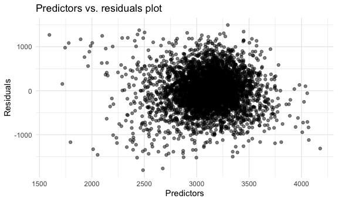
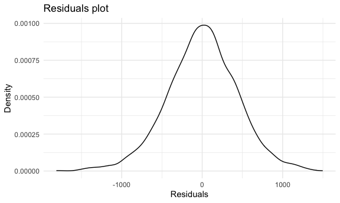
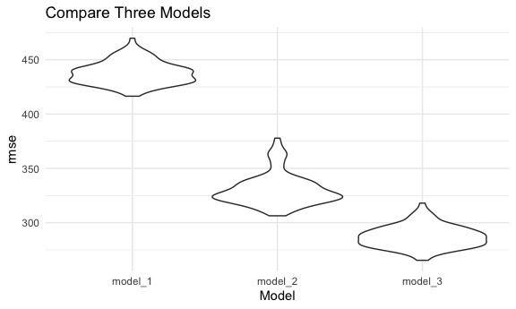
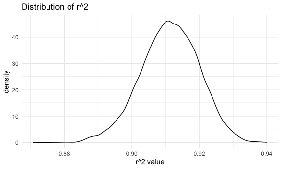
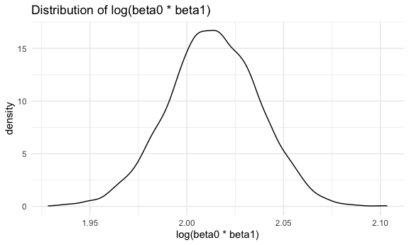

Homework 6
================
Jingyi Zhang

## Problem 1

``` r
homicide_df =
  read_csv("./homicide_data/homicide-data.csv", na = c("", "NA", "Unknown")) %>% 
  mutate(
    city_state = str_c(city, state, sep = ", "),
    victim_age = as.numeric(victim_age),
    resolution = case_when(
      disposition == "Closed without arrest" ~ 0,
      disposition == "Open/No arrest"        ~ 0,
      disposition == "Closed by arrest"      ~ 1)
  ) %>% 
  filter(
    victim_race %in% c("White", "Black"),
    city_state != "Tulsa, AL") %>% 
  select(city_state, resolution, victim_age, victim_race, victim_sex)
```

    ## Parsed with column specification:
    ## cols(
    ##   uid = col_character(),
    ##   reported_date = col_double(),
    ##   victim_last = col_character(),
    ##   victim_first = col_character(),
    ##   victim_race = col_character(),
    ##   victim_age = col_double(),
    ##   victim_sex = col_character(),
    ##   city = col_character(),
    ##   state = col_character(),
    ##   lat = col_double(),
    ##   lon = col_double(),
    ##   disposition = col_character()
    ## )

<br />

#### Start with one city

``` r
baltimore_df =
  homicide_df %>% 
  filter(city_state == "Baltimore, MD")

# fit a generalized linear model
glm(resolution ~ victim_age + victim_race + victim_sex, 
    data = baltimore_df,
    family = binomial()) %>% 
  broom::tidy() %>% 
  mutate(
    OR = exp(estimate), # odds ratio
    CI_lower = exp(estimate - 1.96 * std.error),
    CI_upper = exp(estimate + 1.96 * std.error)
  ) %>% 
  select(term, OR, starts_with("CI")) %>% 
  knitr::kable(digits = 3)
```

| term              |    OR | CI\_lower | CI\_upper |
| :---------------- | ----: | --------: | --------: |
| (Intercept)       | 1.363 |     0.975 |     1.907 |
| victim\_age       | 0.993 |     0.987 |     1.000 |
| victim\_raceWhite | 2.320 |     1.648 |     3.268 |
| victim\_sexMale   | 0.426 |     0.325 |     0.558 |

<br />

#### Try this across cities

``` r
models_results_df =
  homicide_df %>% 
  nest(data = -city_state) %>% 
  mutate(
    models = 
      map(.x = data, ~glm(resolution ~ victim_age + victim_race + victim_sex, data = .x, family = binomial())),
    results = map(models, broom::tidy)
    ) %>% 
  select(city_state, results) %>% 
  unnest(results) %>% 
  mutate(
    OR = exp(estimate), # odds ratio
    CI_lower = exp(estimate - 1.96 * std.error),
    CI_upper = exp(estimate + 1.96 * std.error)
  ) %>% 
  select(city_state, term, OR, starts_with("CI"))
```

``` r
models_results_df %>% 
  filter(term == "victim_sexMale") %>% 
  mutate(city_state = fct_reorder(city_state, OR)) %>% 
  ggplot(aes(x = city_state, y = OR)) +
  geom_point() +
  geom_errorbar(aes(ymin = CI_lower, ymax = CI_upper)) +
  theme(axis.text.x = element_text(angle = 90, vjust = 0.5, hjust = 1))
```


<br />

## Problem 2

``` r
birth_weight_df =
  read_csv("./birth_weight_data/birthweight.csv") %>% 
  janitor::clean_names() %>% 
  drop_na() %>% 
  filter(frace != 9) %>% 
  mutate(
    babysex = case_when(
      babysex == 1 ~ "male",
      babysex == 2 ~ "female"
    ),
    malform = case_when(
      malform == 0 ~ "absent",
      malform == 1 ~ "present"
    ),
    frace = case_when(
      frace == 1 ~ "White",
      frace == 2 ~ "Black",
      frace == 3 ~ "Asian",
      frace == 4 ~ "Puerto Rican",
      frace == 8 ~ "Other"
    ),
    mrace = case_when(
      mrace == 1 ~ "White",
      mrace == 2 ~ "Black",
      mrace == 3 ~ "Asian",
      mrace == 4 ~ "Puerto Rican",
      mrace == 8 ~ "Other"
    )
  ) %>% 
  mutate(
    across(where(is.character), as.factor)
  )
```

    ## Parsed with column specification:
    ## cols(
    ##   .default = col_double()
    ## )

    ## See spec(...) for full column specifications.

<br />

#### Build models - Step-wise Backward Method

Model 1:

The assumption is that mother’s physical characteristics have effects on
baby birth weights.

First, fit the model for all predictors.

``` r
fit_df =
  birth_weight_df %>% 
  select(bwt, delwt, gaweeks, menarche, mheight, momage, ppbmi, ppwt, smoken)

mul_fit = lm(bwt ~ ., data = fit_df)

summary(mul_fit)
```

    ## 
    ## Call:
    ## lm(formula = bwt ~ ., data = fit_df)
    ## 
    ## Residuals:
    ##      Min       1Q   Median       3Q      Max 
    ## -1807.78  -273.55     5.56   286.60  1493.70 
    ## 
    ## Coefficients:
    ##               Estimate Std. Error t value Pr(>|t|)    
    ## (Intercept) -3216.8150  1055.1013  -3.049 0.002311 ** 
    ## delwt           9.7578     0.6243  15.630  < 2e-16 ***
    ## gaweeks        58.5064     2.1586  27.104  < 2e-16 ***
    ## menarche      -10.0667     4.6369  -2.171 0.029986 *  
    ## mheight        52.0881    16.5114   3.155 0.001618 ** 
    ## momage         13.0762     1.7882   7.313 3.11e-13 ***
    ## ppbmi          46.6235    23.9129   1.950 0.051274 .  
    ## ppwt          -14.7067     4.1936  -3.507 0.000458 ***
    ## smoken         -7.7614     0.9043  -8.583  < 2e-16 ***
    ## ---
    ## Signif. codes:  0 '***' 0.001 '**' 0.01 '*' 0.05 '.' 0.1 ' ' 1
    ## 
    ## Residual standard error: 439.1 on 4333 degrees of freedom
    ## Multiple R-squared:  0.2662, Adjusted R-squared:  0.2649 
    ## F-statistic: 196.5 on 8 and 4333 DF,  p-value: < 2.2e-16

<br />

Use function “step( )” for variable selection based on AIC criterion,
the option used is “backward”.

``` r
step(mul_fit, direction = "backward")
```

    ## Start:  AIC=52849.09
    ## bwt ~ delwt + gaweeks + menarche + mheight + momage + ppbmi + 
    ##     ppwt + smoken
    ## 
    ##            Df Sum of Sq       RSS   AIC
    ## <none>                  835503146 52849
    ## - ppbmi     1    733002 836236148 52851
    ## - menarche  1    908809 836411955 52852
    ## - mheight   1   1918979 837422124 52857
    ## - ppwt      1   2371472 837874618 52859
    ## - momage    1  10310793 845813939 52900
    ## - smoken    1  14203647 849706793 52920
    ## - delwt     1  47104721 882607867 53085
    ## - gaweeks   1 141655468 977158613 53527

    ## 
    ## Call:
    ## lm(formula = bwt ~ delwt + gaweeks + menarche + mheight + momage + 
    ##     ppbmi + ppwt + smoken, data = fit_df)
    ## 
    ## Coefficients:
    ## (Intercept)        delwt      gaweeks     menarche      mheight       momage  
    ##   -3216.815        9.758       58.506      -10.067       52.088       13.076  
    ##       ppbmi         ppwt       smoken  
    ##      46.624      -14.707       -7.761

The goal is to have the lowest AIC for all predictors combined. The
output showed that AIC increased after taking out each variable, thus,
all variables are significant predictors for baby birth weights. We
should keep all predictors.

<br />

``` r
model_1 = lm(bwt ~ ., data = fit_df)

model_1 %>% 
  broom::tidy() %>% 
  select(-std.error, -statistic) %>% 
  knitr::kable()
```

| term        |      estimate |   p.value |
| :---------- | ------------: | --------: |
| (Intercept) | \-3216.815000 | 0.0023113 |
| delwt       |      9.757810 | 0.0000000 |
| gaweeks     |     58.506388 | 0.0000000 |
| menarche    |   \-10.066684 | 0.0299865 |
| mheight     |     52.088127 | 0.0016177 |
| momage      |     13.076152 | 0.0000000 |
| ppbmi       |     46.623525 | 0.0512736 |
| ppwt        |   \-14.706727 | 0.0004579 |
| smoken      |    \-7.761378 | 0.0000000 |

<br />

``` r
fit_df =
  fit_df %>% 
  modelr::add_residuals(model_1) %>% 
  modelr::add_predictions(model_1)

fit_df
```

    ## # A tibble: 4,342 x 11
    ##      bwt delwt gaweeks menarche mheight momage ppbmi  ppwt smoken   resid  pred
    ##    <dbl> <dbl>   <dbl>    <dbl>   <dbl>  <dbl> <dbl> <dbl>  <dbl>   <dbl> <dbl>
    ##  1  3629   177    39.9       13      63     36  26.3   148      0  115.   3514.
    ##  2  3062   156    25.9       14      65     25  21.3   128      0  557.   2505.
    ##  3  3345   148    39.9       12      64     29  23.6   137      1  115.   3230.
    ##  4  3062   157    40         14      64     18  21.8   127     10  -94.6  3157.
    ##  5  3374   156    41.6       13      66     20  21.0   130      1    5.57 3368.
    ##  6  3374   129    40.7       12      66     23  18.6   115      0  157.   3217.
    ##  7  2523   126    40.3       14      72     29  14.3   105      0 -957.   3480.
    ##  8  2778   140    37.4       12      62     19  21.8   119      0 -183.   2961.
    ##  9  3515   146    40.3       11      61     13  19.9   105      0  330.   3185.
    ## 10  3459   169    40.7       12      64     19  24.9   145      4  185.   3274.
    ## # … with 4,332 more rows

<br />

#### Look at residuals

``` r
fit_df %>% 
  ggplot(aes(x = pred, y = resid)) +
  geom_point(alpha = 0.5) +
  labs(
    title = "Predictors vs. residuals plot",
    x = "Predictors",
    y = "Residuals"
  )
```



  - From the graph, the dots are scattered around a center which is
    slightly skewed to the right. There are a few dots far from the
    scatter but nothing extreme is observed.

<!-- end list -->

``` r
fit_df %>% 
  ggplot(aes(x = resid)) +
  geom_density() +
  labs(
    title = "Residuals plot",
    x = "Residuals",
    y = "Density"
  )
```



  - The density plot of residuals is relatively symmetric with a slight
    skewness to the right. In general, residuals seem to be centered
    around zero.

<br />

#### Create other two models

Model 2: Length at birth and gestational age as predictors

``` r
model_2 = lm(bwt ~ blength + gaweeks, data = birth_weight_df)

model_2 %>% 
  broom::tidy() %>% 
  select(-std.error, -statistic) %>% 
  knitr::kable()
```

| term        |     estimate | p.value |
| :---------- | -----------: | ------: |
| (Intercept) | \-4347.66707 |       0 |
| blength     |    128.55569 |       0 |
| gaweeks     |     27.04673 |       0 |

Model 3: Head circumference, length, sex and all interactions between
these.

``` r
model_3 = lm(bwt ~ bhead * blength * babysex, data = birth_weight_df)

model_3 %>% 
  broom::tidy() %>% 
  select(-std.error, -statistic) %>% 
  knitr::kable()
```

| term                      |      estimate |   p.value |
| :------------------------ | ------------: | --------: |
| (Intercept)               |  \-801.948671 | 0.4669480 |
| bhead                     |   \-16.597546 | 0.6263883 |
| blength                   |   \-21.645964 | 0.3544209 |
| babysexmale               | \-6374.868351 | 0.0001469 |
| bhead:blength             |      3.324444 | 0.0000032 |
| bhead:babysexmale         |    198.393181 | 0.0001047 |
| blength:babysexmale       |    123.772887 | 0.0004288 |
| bhead:blength:babysexmale |    \-3.878053 | 0.0002453 |

<br />

#### Cross validation for three models

``` r
cv_df =
  crossv_mc(birth_weight_df, 100) %>% 
  mutate(
    train = map(train, as_tibble),
    test = map(test, as_tibble)
  )

cv_birth_weight =
  cv_df %>% 
    mutate(
        model_1 = map(train, ~lm(bwt ~ delwt + gaweeks + menarche + mheight + momage + ppbmi + ppwt + smoken, data = .x)),
        model_2 = map(train, ~lm(bwt ~ blength + gaweeks, data = .x)),
        model_3 = map(train, ~lm(bwt ~ bhead * blength * babysex, data = .x))
    ) %>% 
    mutate(
        rmse_model_1 = map2_dbl(model_1, test, ~rmse(model = .x, data = .y)),
        rmse_model_2 = map2_dbl(model_2, test, ~rmse(model = .x, data = .y)),
        rmse_model_3 = map2_dbl(model_3, test, ~rmse(model = .x, data = .y))
    )
```

<br />

#### Compare the models

``` r
cv_birth_weight %>% 
  select(starts_with("rmse")) %>% 
  pivot_longer(
    everything(),
    names_to = "model",
    values_to = "rmse",
    names_prefix = "rmse_"
  ) %>% 
  ggplot(aes(x = model, y = rmse)) +
  geom_violin() +
  labs(
    title = "Compare Three Models",
    x = "Model",
    y = "rmse"
  )
```



According to the graph, model 3 has the lowest rmse indicates it is the
best one out of three models. The model I created has the highest rmse
indicates it is the worst one out of three models.

<br />

## Problem 3

``` r
weather_df = 
  rnoaa::meteo_pull_monitors(
    c("USW00094728"),
    var = c("PRCP", "TMIN", "TMAX"), 
    date_min = "2017-01-01",
    date_max = "2017-12-31") %>%
  mutate(
    name = recode(id, USW00094728 = "CentralPark_NY"),
    tmin = tmin / 10,
    tmax = tmax / 10) %>%
  select(name, id, everything())
```

    ## Registered S3 method overwritten by 'hoardr':
    ##   method           from
    ##   print.cache_info httr

    ## using cached file: /Users/zhangeffy1/Library/Caches/R/noaa_ghcnd/USW00094728.dly

    ## date created (size, mb): 2020-10-04 10:01:19 (7.522)

    ## file min/max dates: 1869-01-01 / 2020-10-31

<br />

#### Generate 5000 bootstrap results

``` r
boot_results =
  weather_df %>% 
  bootstrap(n = 5000, id = "strap_number") %>% 
  mutate(
    models = map(strap, ~lm(tmax ~ tmin, data = .x)),
    results_tidy = map(models, broom::tidy),
    results_glance = map(models, broom::glance)
  ) %>% 
  unnest(results_tidy, results_glance) %>% 
  select(strap_number, term, estimate, r_squared = r.squared)

boot_results
```

    ## # A tibble: 10,000 x 4
    ##    strap_number term        estimate r_squared
    ##    <chr>        <chr>          <dbl>     <dbl>
    ##  1 0001         (Intercept)    7.73      0.902
    ##  2 0001         tmin           0.996     0.902
    ##  3 0002         (Intercept)    6.94      0.921
    ##  4 0002         tmin           1.05      0.921
    ##  5 0003         (Intercept)    7.22      0.907
    ##  6 0003         tmin           1.04      0.907
    ##  7 0004         (Intercept)    7.21      0.910
    ##  8 0004         tmin           1.04      0.910
    ##  9 0005         (Intercept)    7.07      0.904
    ## 10 0005         tmin           1.05      0.904
    ## # … with 9,990 more rows

<br />

#### Look at distribution of r^2

``` r
boot_results %>% 
  ggplot(aes(x = r_squared)) +
  geom_density() +
  labs(
    title = "Distribution of r^2",
    x = "r^2 value"
  )
```



  - From the graph, r^2 is relatively normal distributed. It is centered
    around 0.91 which is close to 1.

<br />

#### Obtain estimates for log(beta0 \* beta1)

``` r
log_df =
  boot_results %>% 
  select(strap_number, term, estimate) %>% 
  pivot_wider(
    names_from = term,
    values_from = estimate
  ) %>% 
  rename(intercept = `(Intercept)`) %>% 
  mutate(
    log_beta = log(intercept * tmin)
  )
```

<br />

#### Look at distribution of log(beta0 \* beta1)

``` r
log_df %>% 
  ggplot(aes(x = log_beta)) +
  geom_density() +
  labs(
    title = "Distribution of log(beta0 * beta1)",
    x = "log(beta0 * beta1)"
  )
```



  - The distribution of log(beta0 \* beta1) is relatively normal. It is
    centered around 2.01.

<br />

#### Identify the 2.5% and 97.5% quantiles to provide a 95% CI for two quantities

``` r
quantile(boot_results %>% pull(r_squared), probs = c(0.025, 0.975)) %>% 
  knitr::kable()
```

|       |         x |
| :---- | --------: |
| 2.5%  | 0.8943591 |
| 97.5% | 0.9269813 |

  - The 95% CI for r^2 is between 0.895 and 0.927

<br />

``` r
quantile(log_df %>% pull(log_beta), probs = c(0.025, 0.975)) %>% 
  knitr::kable()
```

|       |        x |
| :---- | -------: |
| 2.5%  | 1.965999 |
| 97.5% | 2.059236 |

  - The 95% CI for log(beta0 \* beta1) is between 1.964 and 2.060
